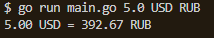

# currency-exchange-cli
Обычный конвертер валют в консольке. ниче нового заумного.
Обращение по [API](https://www.exchangerate-api.com/)
## Args
1. ```amount``` - сумма денег
2. ```baseCurrency``` - из какой валюты
3. ```newCurrency``` - в какую валюту

Например, ```go run main.go 5.0 USD RUB```. Ответ в формате:



